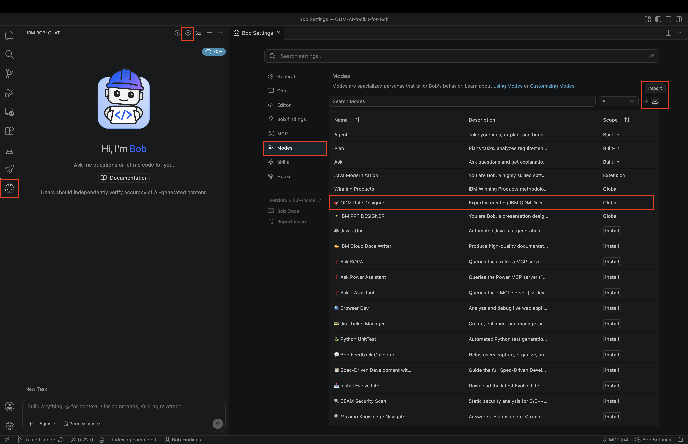
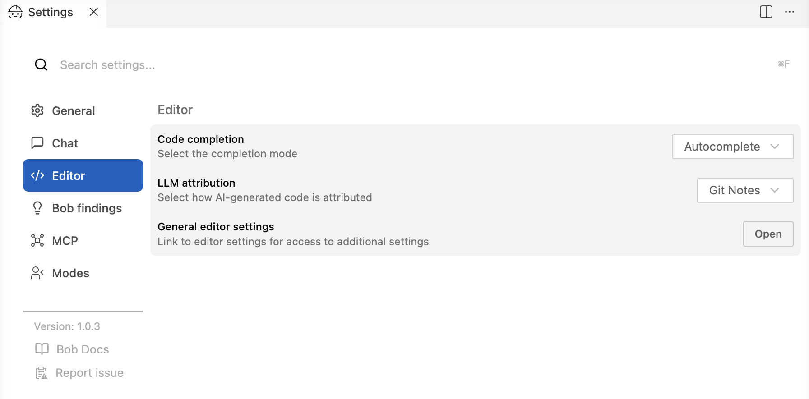
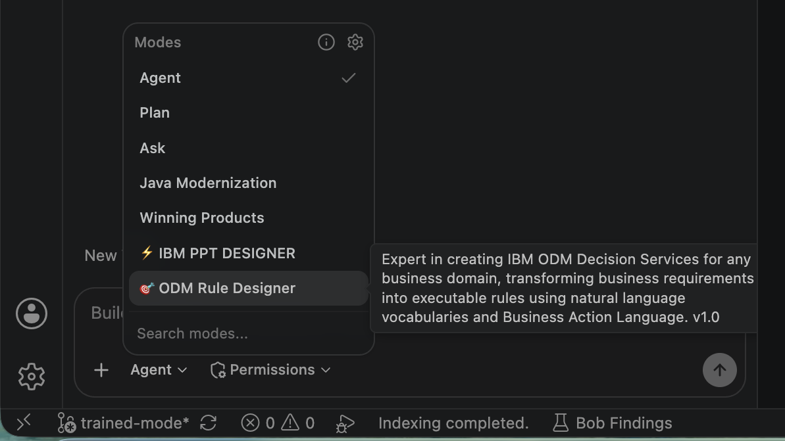
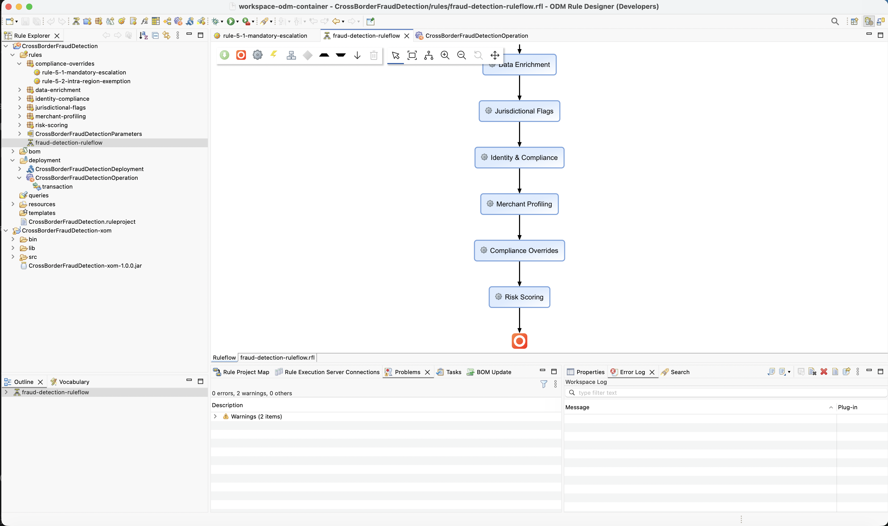

# 🎯 ODM AI Toolkit

> **Transform business rules into intelligent decision services with AI assistants**

Build production-ready IBM ODM Decision Services in minutes, not days. This toolkit turns natural language descriptions and policy documents into complete, deployable ODM rule projects. It comes in two forms:

- 🟣 **IBM Bob Mode**: a custom mode for [IBM Bob](https://bob.ibm.com)
- 🧩 **Agent Skill**: the [`odm-rule-designer`](skills/odm-rule-designer/SKILL.md) skill for Claude Code, IBM Bob, and any agent that supports the open [Agent Skills](https://agentskills.io) format

[](LICENSE)
[](https://www.ibm.com/products/operational-decision-manager)
[](https://bob.ibm.com)
[](skills/odm-rule-designer/SKILL.md)

---

## 🤖 What Does It Generate?

Describe your business rules in natural language, and the AI assistant acts as an expert ODM developer. It generates:

- ✅ Complete XOM (Java domain model)
- ✅ BOM (Business Object Model) with natural language vocabulary
- ✅ Business rules in Business Action Language (BAL) and decision tables
- ✅ Ruleflow orchestration
- ✅ Deployment configuration

**All generated projects are fully compatible with ODM Rule Designer.**

---

## 🚀 What Can You Build?

The toolkit can generate complete ODM Decision Services for any business domain:

- 💰 **Financial Services**: Fraud detection, loan approval, AML compliance
- ✈️ **Aviation**: Emissions compliance, baggage rules, safety regulations
- 🏥 **Healthcare**: Risk assessment, treatment protocols, eligibility rules
- 🏭 **Manufacturing**: Quality control, supply chain optimization
- 🛒 **Retail**: Pricing rules, promotion eligibility, inventory management

**See it in action:**

https://github.com/user-attachments/assets/c7c9595b-2b05-4fde-aa51-673526783674

---

## 🧭 Choose Your Path

| | 🟣 Bob Mode | 🧩 Agent Skill (`odm-rule-designer`) |
|---|---|---|
| **Runs in** | IBM Bob | Claude Code, IBM Bob, any Agent Skills-compatible agent |
| **Install** | Import `custom_modes.yaml` | Copy the skill folder |
| **Generate XOM, BOM, vocabulary, BAL, ruleflow** | ✅ | ✅ |
| **Local build with the rules compiler** | ✅ | ✅ matching JDK picked for your ODM release |
| **Rules compiler setup** | Manual (one-time) | Automatic (`odm compiler`) |
| **Consistent XML boilerplate (UUIDs, cross-links)** | Generated by the LLM | Generated by the `odm` CLI |
| **Design best-practice review** | — | ✅ `odm check` |
| **Rule dependency analysis → ruleflow design** | — | ✅ `odm deps` / `odm ruleflow` |
| **Deploy to Decision Center** | — | ✅ via the ODM Management MCP Server |
| **Deploy a RuleApp to the RES console** | — | ✅ via the ODM Management MCP Server |

➡️ [Quick Start: Bob Mode](#-quick-start-bob-mode) · [Quick Start: Agent Skill](#-quick-start-agent-skill)

---

## 📋 Prerequisites (Both Paths)

- **An AI assistant**: [IBM Bob](https://bob.ibm.com/docs/ide/getting-started/install), [Claude Code](https://docs.claude.com/en/docs/claude-code), or another Agent Skills-compatible agent
- **ODM Rule Designer** (optional, to open the generated projects): [Install here](https://github.com/DecisionsDev/ruledesigner#installation)
- **Java**: the JDK matching your ODM release. Only ODM 9.x is supported:

  | ODM | Rules compiler JDK | XOM `--release` |
  |---|---|---|
  | 9.0.x | 17 | 17 |
  | 9.5.x, 9.6.x | 21 | 17 |
  | 9.7.x | 25 | 17 |

  Set `ODM_JAVA_HOME` if that JDK isn't your default. IBM Semeru OpenJ9 is recommended.
- **Docker or Podman** (optional): to fetch the rules compiler when you have no local ODM installation

---

## 🟣 Quick Start: Bob Mode

### 1️⃣ Import the ODM Rule Designer Bob Mode

The custom mode is defined in [`custom_modes.yaml`](./files/custom_modes.yaml). To import it:

1. Open Bob settings (gear icon ⚙️ in upper right)
2. Select **Modes** from left panel
3. Click **Import** button
4. Select [`custom_modes.yaml`](./files/custom_modes.yaml)
5. The **🎯 ODM Rule Designer** mode is now available! ✅



Change the LLM attribution mode to avoid the following message at the end of generated XML files, because it breaks the ODM build command:

```bash
<!-- Made with Bob -->
```

1. Open Bob settings (gear icon ⚙️ in upper right)
2. Select **Editor** from left panel
3. Select **Git Notes** for **LLM attribution**



### 2️⃣ Set Up the ODM Build Command (One-Time Setup)

Before creating or modifying ODM projects, put the ODM Build Command compiler in your workspace directory. Bob uses it to validate and build Decision Services.

**Choose one of the following methods:**

#### Option A: Copy from Local ODM Installation

If you have ODM installed on-premises:

```bash
# Create the buildcommand directory structure
mkdir -p buildcommand/rules-compiler

# Copy the rules compiler from your ODM installation
cp "$ODM_HOME/buildcommand/rules-compiler/rules-compiler.jar" buildcommand/rules-compiler/
```

#### Option B: Download via ODM for Developers Docker Image

If you don't have ODM installed locally:

```bash
# Start ODM container
docker run -d -e LICENSE=accept -p 9060:9060 -p 9443:9443 -u $(id -u) \
  --name odm-buildcmd icr.io/cpopen/odm-k8s/odm:latest

# Wait ~60 seconds, then download and extract
curl http://localhost:9060/decisioncenter/assets/buildcommand.zip --output buildcommand.zip
unzip -o buildcommand.zip -d buildcommand 'rules-compiler/*'

# Verify and cleanup
ls -lh buildcommand/rules-compiler/rules-compiler.jar
docker stop odm-buildcmd && docker rm odm-buildcmd
```

✅ **Setup Complete!** `buildcommand/rules-compiler/rules-compiler.jar` is now in your workspace.

> **Note**: This is a one-time setup per workspace. Once the rules compiler is in place, Bob uses it to validate all generated Decision Services.

### 3️⃣ Generate Your First Decision Service with Bob

1. Select **🎯 ODM Rule Designer** mode from the mode selector at the bottom of Bob

2. Provide your business requirements using one of these approaches:

   **Option A: Use a Policy Document (Recommended)**
   ```
   Generate an ODM rule project based on the Cross-Border Transaction Fraud Detection policy
   in files/Cross-Border-Transaction-Fraud-Detection-Compliance-Policy.txt
   ```

   **Option B: Natural Language Description**
   ```
   Generate a fraud validation ODM rule project based on geo location transaction
   ```

   **Sample Policy**: See [`Cross-Border-Transaction-Fraud-Detection-Compliance-Policy.txt`](files/Cross-Border-Transaction-Fraud-Detection-Compliance-Policy.txt)

3. Click **✨ Enhance prompt** for richer context (optional but recommended)

4. Watch Bob generate your complete ODM project in real time!



**Bob will create:**
- Java XOM classes with proper serialization
- BOM files in text-based BRL format
- Vocabulary files for natural language rules
- Business rules using Business Action Language
- Ruleflow for rule orchestration
- Deployment operations for the Decision Service
- Build validation using the ODM Build Command

Then [import the generated project into Rule Designer](#-import-a-generated-project-into-rule-designer).

---

## 🧩 Quick Start: Agent Skill

The [`odm-rule-designer`](skills/odm-rule-designer/SKILL.md) skill packages the ODM expertise as an [Agent Skill](https://agentskills.io): instructions, reference guides and a small Java CLI (`odm.jar`, JDK only, no Python or Maven). The CLI generates all XML boilerplate (`.ruleproject`, `.rfl`, `.dop`, `.var`, build `.properties`…) with consistent UUIDs and cross-links, so the agent only writes the Java classes, the BOM and vocabulary, and the BAL rule bodies.

### 1️⃣ Install the Skill

A skill is a folder with a `SKILL.md` file. To install it, copy (or symlink) the `skills/odm-rule-designer` folder into your agent's skills directory. You can install it:

- **per project**: only available in that project, and can be committed with it so your team gets it too
- **for all projects**: available in every project on your machine

First, get the toolkit:

```bash
git clone https://github.com/DecisionsDev/ODM-AI-toolkit-for-Bob.git
```

#### Install in Claude Code

| Scope | Skills directory |
|---|---|
| Per project | `<project>/.claude/skills/` |
| All projects | `~/.claude/skills/` |

```bash
# For all projects
mkdir -p ~/.claude/skills
cp -R ODM-AI-toolkit-for-Bob/skills/odm-rule-designer ~/.claude/skills/

# Or for one project only
mkdir -p <project>/.claude/skills
cp -R ODM-AI-toolkit-for-Bob/skills/odm-rule-designer <project>/.claude/skills/
```

To use a symlink instead of a copy, so that a `git pull` of the toolkit updates the skill:

```bash
ln -s "$(pwd)/ODM-AI-toolkit-for-Bob/skills/odm-rule-designer" ~/.claude/skills/odm-rule-designer
```

**Check that it loaded:** start a new Claude Code session (skills are discovered at startup) and run `/skills`, or ask *"What skills do you have?"*. `odm-rule-designer` should be listed.

#### Install in IBM Bob

| Scope | Skills directory |
|---|---|
| Per project | `<project>/.bob/skills/` |
| All projects | `~/.bob/skills/` |

```bash
# For all projects
mkdir -p ~/.bob/skills
cp -R ODM-AI-toolkit-for-Bob/skills/odm-rule-designer ~/.bob/skills/

# Or for one project only
mkdir -p <project>/.bob/skills
cp -R ODM-AI-toolkit-for-Bob/skills/odm-rule-designer <project>/.bob/skills/
```

**Check that it loaded:** reload the Bob window, then ask *"What skills do you have?"*. `odm-rule-designer` should be listed. See the [Bob documentation](https://bob.ibm.com/docs) for more about skills in Bob.

> **Tip**: As with the Bob Mode, set **LLM attribution** to **Git Notes** (see [Bob Mode step 1](#1️⃣-import-the-odm-rule-designer-bob-mode)) so Bob doesn't add `<!-- Made with Bob -->` to the generated XML files.

#### Install in Other Agents

Any agent that supports the open [Agent Skills](https://agentskills.io) format can use the skill. Copy the `odm-rule-designer` folder into the skills directory given in your agent's documentation.

#### Using the Skill

You don't need a mode or slash command. The agent loads the skill automatically when you ask about IBM ODM, business rules, BOM/XOM/BAL, ruleflows, or deployment, in any language.

### 2️⃣ Rules Compiler: Nothing to Do

The skill checks for the rules compiler before it writes any code. If none is found, it installs one into `<project>/buildcommand/rules-compiler/`, either copied from `$ODM_HOME` or extracted from the ODM Docker image (`icr.io/cpopen/odm-k8s/odm`, no server started). To pin an ODM release, name it in your prompt (for example "use ODM 9.5"). The skill then runs the compiler on the exact JDK that release requires.

You can also run the check yourself:

```bash
java -jar skills/odm-rule-designer/scripts/odm.jar jdk        # the jar used, its ODM release, and the JDK
java -jar skills/odm-rule-designer/scripts/odm.jar compiler --dir <project-root> [--tag 9.5]
```

Details and manual fallbacks: [`references/prerequisites.md`](skills/odm-rule-designer/references/prerequisites.md).

### 3️⃣ Ask Your Agent

**Generate a Decision Service**
```
Generate an ODM rule project based on the Cross-Border Transaction Fraud Detection policy
in files/Cross-Border-Transaction-Fraud-Detection-Compliance-Policy.txt
```

**Analyse rule dependencies and redesign the ruleflow**
```
Why does the rule check-velocity never fire in projects/Fraud/FraudDetection?
Analyse the dependencies between the rules and fix the ruleflow.
```

**Review against ODM best practices**
```
Review the FraudDetection rule project against ODM design best practices.
```

**Deploy to Decision Center**
```
Deploy the FraudDetection rule project to Decision Center.
```

**Deploy the RuleApp to the Rule Execution Server**
```
Build the FraudDetection RuleApp and deploy it to the RES console.
```

The skill works in any language, for example: *"Analyse les dépendances entre les règles et propose un ruleflow."*

### ✨ What the Skill Adds

- **Guaranteed build**: a task is done only when `odm build` prints `BUILD SUCCESS`. The RuleApp embeds the XOM, and the XOM is compiled for `--release 17` so it runs on any ODM 9.x RES.
- **Best-practice review**: `odm check` validates UUIDs, links and file names, lints BAL, and reports design best-practice violations (rule layout, one action per rule, no `else`/`or`/priorities, Fastpath-only ruleflows, decision table size…). See [`best-practices.md`](skills/odm-rule-designer/references/best-practices.md).
- **Rule dependencies → ruleflow**: `odm deps` finds which rules write what others read and flags rules that read a value before it is written. `odm ruleflow` rewrites the `.rfl` in the right order. See [`ruleflow-design.md`](skills/odm-rule-designer/references/ruleflow-design.md).
- **Decision Center deployment**: `odm export` packages the rule project and its managed XOM library as a zip, which is then imported and deployed through the ODM Management MCP Server. See [`decision-center-deployment.md`](skills/odm-rule-designer/references/decision-center-deployment.md).
- **RES deployment**: deploys the RuleApp built by `odm build` to the Rule Execution Server console through the ODM Management MCP Server. See [`decision-server-console-deployment.md`](skills/odm-rule-designer/references/decision-server-console-deployment.md).

The agent always asks before it imports or deploys anything. Without the MCP server, it gives you the archive path and the manual steps.

### 📚 Skill Reference Guides

| Guide | Covers |
|---|---|
| [`SKILL.md`](skills/odm-rule-designer/SKILL.md) | Workflow, build-breaking rules, error → fix table |
| [`prerequisites.md`](skills/odm-rule-designer/references/prerequisites.md) | Installing and locating the rules compiler, JDK alignment |
| [`xom.md`](skills/odm-rule-designer/references/xom.md) | Java XOM conventions, Jackson, computed properties |
| [`bom-format.md`](skills/odm-rule-designer/references/bom-format.md) | BOM syntax and annotations |
| [`vocabulary-and-bal.md`](skills/odm-rule-designer/references/vocabulary-and-bal.md) | Vocabulary syntax and BAL constraints |
| [`decision-tables.md`](skills/odm-rule-designer/references/decision-tables.md) | Decision tables |
| [`ruleflow-design.md`](skills/odm-rule-designer/references/ruleflow-design.md) | Rule dependencies and ruleflow design |
| [`best-practices.md`](skills/odm-rule-designer/references/best-practices.md) | The design best practices checked by `odm check` |
| [`decision-center-deployment.md`](skills/odm-rule-designer/references/decision-center-deployment.md) | Export and deploy to Decision Center |
| [`decision-server-console-deployment.md`](skills/odm-rule-designer/references/decision-server-console-deployment.md) | Deploy a RuleApp to the RES console |

---

## 🖥️ Import a Generated Project into Rule Designer

This works for projects generated by either path:

1. Open ODM Rule Designer
2. Switch to Rule Perspective: `Window > Perspective > Rule > Open`
3. Import projects: `File > Import > Existing Projects into Workspace`
4. Select both the Rule Project and XOM Project
5. Layout ruleflow: Select `.rfl` file → **Layout all nodes** → **Save**



---

## 💡 Why Use Policy Documents?

Using structured policy documents (like [`Cross-Border-Transaction-Fraud-Detection-Compliance-Policy.txt`](files/Cross-Border-Transaction-Fraud-Detection-Compliance-Policy.txt)) as input provides:

- ✅ **More comprehensive rule coverage**: all business requirements captured
- ✅ **Regulatory compliance**: includes compliance details and thresholds
- ✅ **Better structured output**: organized rule packages and ruleflows
- ✅ **Easier maintenance**: clear traceability from policy to rules
- ✅ **Production-ready**: complete with risk scoring and escalation logic

**Result**: a production-ready decision service in minutes! 🎉

---

## 🏗️ Project Structure

```
ODM-AI-toolkit-for-Bob/
├── files/
│   ├── custom_modes.yaml          # Bob mode definition
│   └── *.txt                      # Sample policy documents
├── .bob/                          # Bob mode rules (ask, plan, agent)
├── skills/
│   └── odm-rule-designer/         # Agent Skill
│       ├── SKILL.md               # Skill entry point
│       ├── references/            # Guides loaded on demand
│       ├── scripts/               # odm CLI (odm.jar + Odm.java source)
│       ├── assets/templates/      # File templates (decision tables…)
│       └── schemas/               # ODM metamodels (from a licensed ODM install)
├── projects/                      # Sample generated Decision Services
├── tools/                         # Utilities (rule project report generator)
└── images/                        # Screenshots
```

---

## 🎓 Learn More

- **[Bob Documentation](https://bob.ibm.com/docs)**: official IBM Bob documentation
- **[Agent Skills](https://agentskills.io)**: the open skill format used by `odm-rule-designer`
- **[Claude Code Skills](https://docs.claude.com/en/docs/claude-code/skills)**: using skills in Claude Code
- **[ODM Report Generator](tools/README-ODM-REPORT-GENERATOR.md)**: generate a Markdown report of a rule project

---

## 🤝 Contributing

We welcome contributions! Whether it's:
- 🐛 Bug reports and fixes
- 💡 New sample projects
- 📖 Documentation improvements
- ✨ Feature enhancements to the Bob mode or the skill

Please use the [GitHub issue tracker](https://github.com/DecisionsDev/ODM-AI-toolkit-for-Bob/issues) for project-specific issues.

For general ODM questions, visit the [ODM Community](https://community.ibm.com/community/user/automation/communities/community-home?CommunityKey=c0005a22-520b-4181-bfad-feffd8bdc022).

---

## 📊 Why This Toolkit?

| Traditional Approach | With the ODM AI Toolkit |
|---------------------|-------------------|
| ⏱️ Days to weeks | ⚡ Minutes to hours |
| 📝 Manual coding | 🤖 The AI assistant generates everything |
| 🔧 Complex setup | 🎯 One-click mode import or skill copy |
| 📚 Steep learning curve | 💬 Natural language prompts |
| 🐛 Error-prone | ✅ Best practices built in and checked |
| 👨‍💻 Requires ODM expertise | 🤖 The AI assistant is the expert |

---

## 🔮 Roadmap

**Current**:
- [x] Bob Mode for ODM Rule Designer
- [x] `odm-rule-designer` Agent Skill
- [x] Decision Center deployment
- [x] RuleApp deployment to the Rule Execution Server

**Coming Soon**:
- [ ] Additional Bob modes and skills (testing, migration)
- [ ] More sample projects (insurance, logistics, energy)
- [ ] CI/CD pipeline templates

---

## 📄 License

[Apache 2.0](LICENSE)

---

## 📢 Notice

© Copyright IBM Corporation 2026.

---

<div align="center">

**Built with ❤️ by the ODM Team**

</div>
